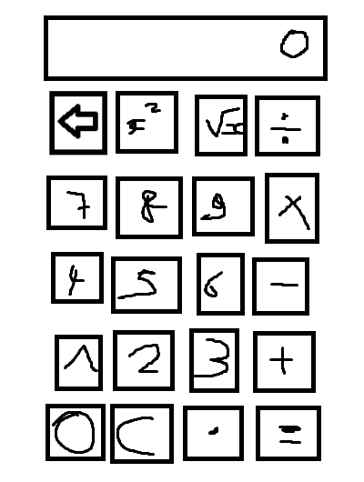

# Calculator

Ce projet est une calculatrice qui reproduit une calculatrice ! (on s'en doutait pas ça...). Le langage est le Java !

# À ajouter pour une futur mise à jour
- Mettre le mode scientifique (pour avoir accès aux fonctions trigonométriques, etc...)

  
(Bon l'image qu'il y a au dessus, c'était le Paint que j'avais fait du projet le premier jour... On va dire que le seul truc qui a changé, c'est l'emplacement du 0 et du C.)  
